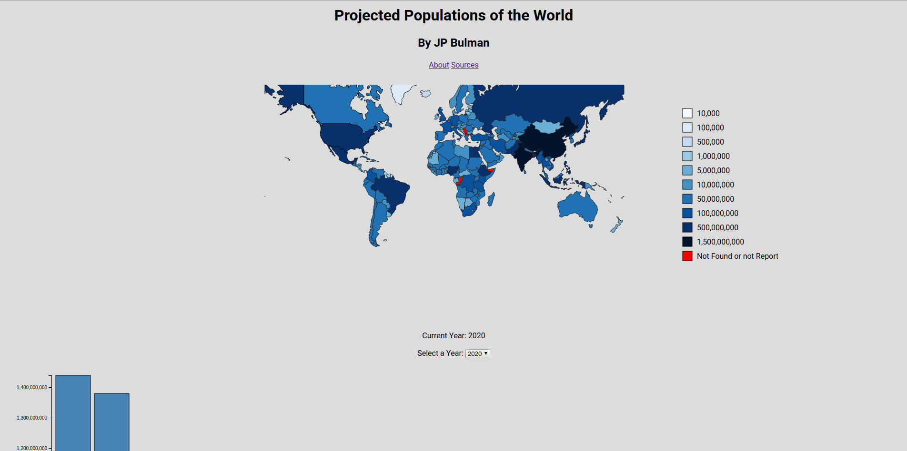
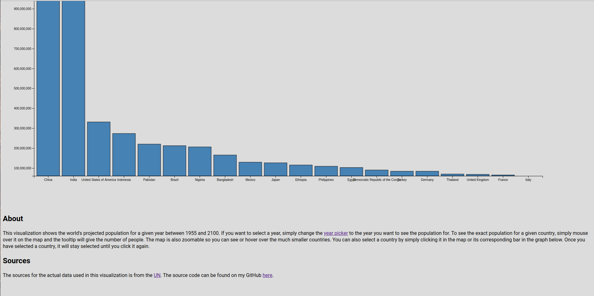

# Assignment 4: Datavis Remix
The goal of this assignment is to find a visualization online, critique it, and then remake it based on the suggestions.

[Visualization](https://jpbulman.github.io/04-Remix/)

## About
This visualization shows the world's projected population for a given year between 1955 and 2100. If you want to select a year, simply change the year picker to the year you want to see the population for. To see the exact population for a given country, simply mouse over it on the map and the tooltip will give the number of people. The map is also zoomable so you can see or hover over the much smaller countries. You can also select a country by simply clicking it in the map or its corresponding bar in the graph below. Once you have selected a country, it will stay selected until you click it again.

## My Visualization
[Link](https://jpbulman.github.io/04-Remix/)

In my visualization, I was able to address many of the issues in the original design (mentioned below). First off, I was able to add in a legend to reference what colors correspond to what populations. This helps the viewer understand what countries are more populated without any confusion or ambiguity. Secondly, I was able to implement a slightly more aesthetically pleasing color scheme. The shades of blue are far less alarming than the reds used previously. Finally, I was able to add a second view that allows the viewer to see the data in more than one way. The bar graph below the map shows just how drastically different certain countries' populations are from others. 

## Original Visualization

[Source](https://i.pinimg.com/originals/99/17/c8/9917c8748a6d25138c6e2a4a53bfbd3b.png)

## Critique

This visualization of the world's population is done fairly well, but is lacking some big features that are crucial to understanding the data. One of the first things that I noticed is that there is no legend. Intuitvely, you would expect the darkert regions to have more people, but even if that is the case, the viewer cannot see exactly how many people that actually is. The second thing I noticed is that there is no given year for this data. It is probably just the year this was made in, but it is not clear if that is the case or not. Finally, I thought that the color scheme could have been chosen a little bit differently. The reds are somewhat alarming and give a sense of danger. The darker shades also clash with the other colors, as they are so dark they are practically black.

## Technical Achievements

The first technical achievement that I was able to accomplish was the year picker. In the previous visualization, the user was only able to see one year, but here, the user can choose from a variety of 145 different years. The second techincal achievement I was able to create was interactivity. The user can now mouse over countries to get population information, zoom in, and even select countries. All of these features make the experience much more enjoyable and some of the data easier to understand.

## Design Achievements

The biggest design achievement I was able to accomplish was refactoring the original design's color scheme. This made the population map far easier to read, as it now has much softer colors. The previously used reds made the countries look intimidating or dangerous as they got darker, which did not really sit well. Instead, I used a much more pleasant scheme I found online.

## Sources
[Bar Chart](https://bl.ocks.org/caravinden/d04238c4c9770020ff6867ee92c7dac1)

Class code for zooming and drawing maps

[Select box](https://electrictoolbox.com/javascript-add-options-html-select/)

[Thresholds for World Population and Color Scheme](http://bl.ocks.org/micahstubbs/8e15870eb432a21f0bc4d3d527b2d14f)

[Tooltips](https://bl.ocks.org/d3noob/a22c42db65eb00d4e369)

[United Nations Projected Population CSV](https://population.un.org/wpp/Download/Standard/CSV/)