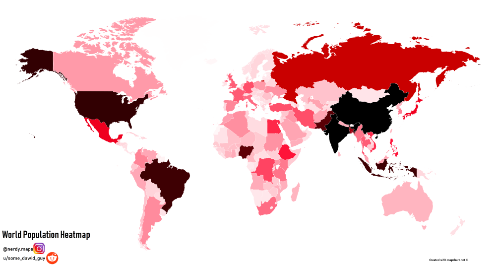

# Assignment 4: Datavis Remix
The goal of this assignment is to find a visualization online, critique it, and then remake it based on the suggestions.

## Original Visualization

[Source](https://i.pinimg.com/originals/99/17/c8/9917c8748a6d25138c6e2a4a53bfbd3b.png)

## Critique

This visualization of the world's population is done fairly well, but is lacking some big features that are crucial to understanding the data. One of the first things that I noticed is that there is no legend. Intuitvely, you would expect the darkert regions to have more people, but even if that is the case, the viewer cannot see exactly how many people that actually is. The second thing I noticed is that there is no given year for this data. It is probably just the year this was made in, but it is not clear if that is the case or not. Finally, I thought that the color scheme could have been chosen a little bit differently. The reds are somewhat alarming and give a sense of danger. The darker shades also clash with the other colors, as they are so dark they are practically black.

## Technical Achievements

## Design Achievements

## Sources
[Bar Chart](https://bl.ocks.org/caravinden/d04238c4c9770020ff6867ee92c7dac1)

[Select box](https://electrictoolbox.com/javascript-add-options-html-select/)

[Thresholds for World Population](http://bl.ocks.org/micahstubbs/8e15870eb432a21f0bc4d3d527b2d14f)

[Tooltips](https://bl.ocks.org/d3noob/a22c42db65eb00d4e369)

[United Nations Projected Population CSV](https://population.un.org/wpp/Download/Standard/CSV/)